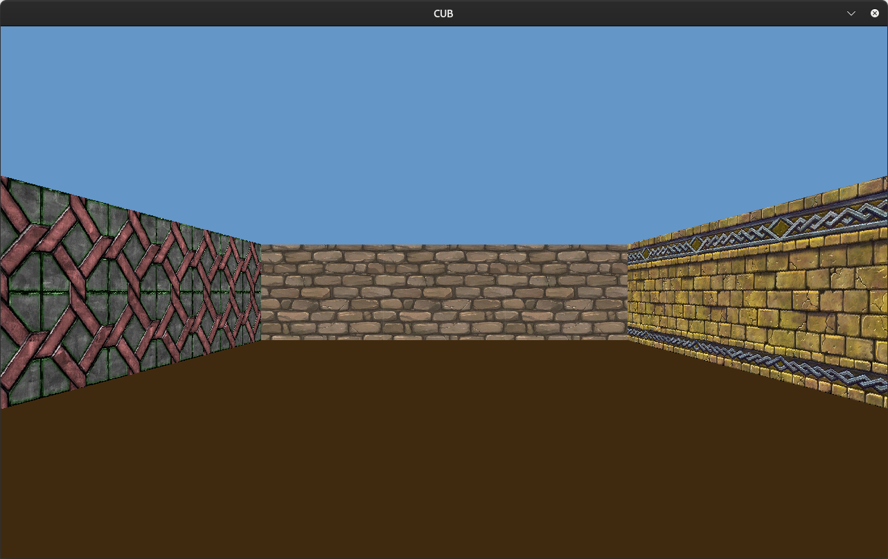
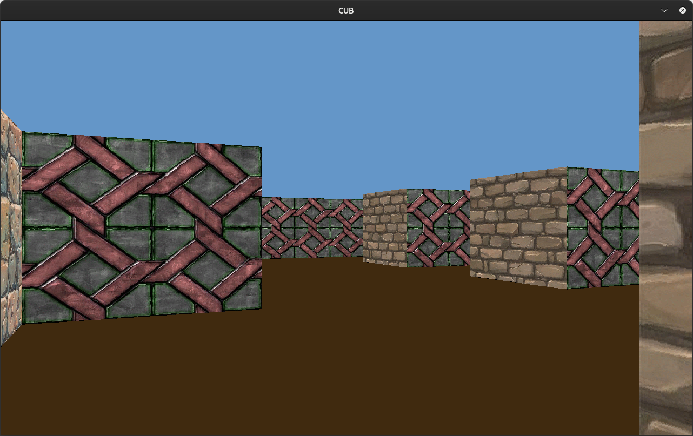

# Raycasting Project

This project implements a simple raycasting engine, a key component of 3D graphics rendering, often used in games like the original *Wolfenstein 3D*. The engine casts rays in a 2D world to simulate the appearance of 3D spaces.

## Table of Contents
- [Overview](#overview)
- [Features](#features)
- [Installation](#installation)
- [Map Structure](#map-structure)
- [Player Movement](#player-movement)
- [Raycasting Logic](#raycasting-logic)

## Overview

The purpose of this project is to explore and implement the raycasting technique. This engine simulates a 3D-like environment in a 2D grid, where rays are cast from the player's viewpoint to detect walls and obstacles, giving the illusion of depth.




## Features

- **Raycasting**: Rays are cast to detect walls and obstacles in the world.
- **Player Movement**: The player can move through the world and change their viewing angle.
- **Wall Rendering**: The detected walls are rendered based on the distance from the player.

## installation

```
   git clone https://github.com/ahmedelqori/raycasting.git
```
```
   cd raycasting
```
```
   make
```
```
   ./cub3D ./maps/mandatory/a.cub
```
## Map Structure

The map is a grid of cells, where walls and open spaces are represented by specific characters. The player can navigate through the world, and the raycasting engine will calculate the nearest walls based on the player's position and direction.

Here is an example of the map format:

```
    NO ./images/n.xpm
    SO ./images/s.xpm
    WE ./images/w.xpm
    EA ./images/e.xpm

    C 100,   150,  200
    F 64 , 42 , 15

            1111111111111111111111111
            1000000000110000000000001
            1011000001110000000000001
            1001000000000000000000001
    111111111011000001110000000000001
    100000000011000001110111111111111
    11110111111111011100000010001
    11110111111111011101010010001
    11000000110101011100000010001
    10000000000000001100000010001
    10000000000000001101010000001
    11000001110101011111011110N0111
    11110111 1110101 101111010001
    11111111 1111111 111111111111
```

- `1` represents a wall.
- `0` represents an open space.
- `NO` represents the texture for the north wall.
- `SO` represents the texture for the south wall.
- `EA` represents the texture for the east wall.
- `WE` represents the texture for the west wall.
- `C` represents the ceiling color in RGB format.
- `F` represents the floor color in RGB format.

## Player Movement and Camera Controls

The player can move and rotate in the game world using keyboard input. The movement is divided into two actions: **movement** (forward and backward) and **camera rotation** (turning left and right).

### Controls:

- **W**: Move forward (towards the direction the player is facing).
- **S**: Move backward (away from the direction the player is facing).
- **A**: Move left (sideways, perpendicular to the player's facing direction).
- **D**: Move right (sideways, perpendicular to the player's facing direction).
- **Left Arrow**: Rotate the camera to the left (counterclockwise).
- **Right Arrow**: Rotate the camera to the right (clockwise).

## Raycasting Logic

### Player Direction and Field of View (FOV)

In the raycasting engine, the player's direction and camera projection are controlled by vectors. These vectors are based on the player's orientation (direction) and the **Field of View (FOV)**, which defines how much of the world is visible at any given moment.

#### Direction Vector (`dir`)

The **direction vector** determines the direction the player is facing in the game world. It represents the player's orientation and is used for movement and raycasting.

For example:
- **Facing North**: The direction vector would be `(0, -1)` because the player is looking along the negative y-axis.
- **Facing East**: The direction vector would be `(1, 0)` because the player is looking along the positive x-axis.
- **Facing South**: The direction vector would be `(0, 1)` because the player is looking along the positive y-axis.
- **Facing West**: The direction vector would be `(-1, 0)` because the player is looking along the negative x-axis.

#### Plane Vector (`pln`)

The **plane vector** is perpendicular to the direction vector and defines the camera's projection, which affects how the scene is rendered from the player's perspective. This vector controls the width of the player's view.

#### Calculating the Plane Vector Based on FOV

The plane vector is calculated using the **Field of View (FOV)** angle, which defines how wide the player's view is. The FOV angle determines how much the scene is stretched horizontally as the player moves away from the origin.

For a given **FOV** of `66°`, the **plane vector** is calculated using the following formula:

- **FOV / 2 = 33°** (half of the FOV angle).
- **tan(33°) ≈ 0.66**.

This means that at a 33° angle (half of 66°), the horizontal stretch on the projection plane is approximately `0.66` units of length for every unit of depth in the player's direction.

#### Example Vectors for Different Directions

1. **Facing North (FOV = 66°)**:
   - **Direction Vector (`dir`)**: `(0, -1)` (North).
   - **Plane Vector (`pln`)**: `(0.66, 0)` (calculated using `tan(33°)`).

2. **Facing East (FOV = 66°)**:
   - **Direction Vector (`dir`)**: `(1, 0)` (East).
   - **Plane Vector (`pln`)**: `(0, 0.66)` (calculated using `tan(33°)`).

3. **Facing South (FOV = 66°)**:
   - **Direction Vector (`dir`)**: `(0, 1)` (South).
   - **Plane Vector (`pln`)**: `(-0.66, 0)` (calculated using `tan(33°)`).

4. **Facing West (FOV = 66°)**:
   - **Direction Vector (`dir`)**: `(-1, 0)` (West).
   - **Plane Vector (`pln`)**: `(0, -0.66)` (calculated using `tan(33°)`).

#### How These Vectors Affect Raycasting

- **Direction Vector**: The direction vector (`dir`) determines the direction in which rays are cast. The rays are projected based on the player's current facing direction.
- **Plane Vector**: The plane vector (`pln`) controls the width of the camera's view. It is used to calculate the perspective, helping to render the world properly as the player moves and rotates.

These vectors are crucial for implementing movement and rendering the 3D world in the raycasting engine, as they define both the player's viewpoint and how th

### Raycasting: `calc_ray_for_y_x` Function

The `calc_ray_for_y_x` function calculates the ray's direction and step size for both horizontal and vertical axes in the raycasting process. It uses the player's position, direction, and plane vector to compute the necessary values for accurate raycasting and collision detection.

#### Key Steps:
- **Camera X Calculation**: Determines the ray's horizontal direction based on the player's x-position and screen width.
- **Ray Direction**: Calculates the ray’s horizontal and vertical components using the player's direction and plane vectors.
- **Map Coordinates**: Floors the player’s position to determine the player's current map grid coordinates.
- **Delta Calculation**: Computes the step size (`delta.horz` and `delta.vert`) for the ray's movement along the grid in both horizontal and vertical directions.

#### Importance of Delta:
- **Delta values** (`delta.horz` and `delta.vert`) determine how much the ray moves in each step during the raycasting process.
- These values ensure the ray moves across the map grid, checking for collisions with walls in each direction.

This function is essential for the core of raycasting, enabling accurate perspective rendering and efficient wall detection in the game world.

### Step Calculation: `calc_step_for_x` and `calc_step_for_y` Functions

These functions calculate the **step direction** and **side distance** for the ray as it moves through the grid in both the **horizontal (x-axis)** and **vertical (y-axis)** directions during the raycasting process.

#### `calc_step_for_x`:
- **Step Direction**: Determines whether the ray is moving left (`stepx = -1`) or right (`stepx = 1`) based on the **horizontal direction** of the ray (`ray.horz`).
- **Side Distance**: Computes the initial side distance in the x-direction (`sidedist.horz`), which is the distance the ray must travel before intersecting a vertical grid line.
  
#### `calc_step_for_y`:
- **Step Direction**: Determines whether the ray is moving up (`stepy = -1`) or down (`stepy = 1`) based on the **vertical direction** of the ray (`ray.vert`).
- **Side Distance**: Computes the initial side distance in the y-direction (`sidedist.vert`), which is the distance the ray must travel before intersecting a horizontal grid line.

#### Importance of Step Calculation:
- The **step direction** (`stepx` and `stepy`) determines the ray's movement across the map grid in either the x or y direction. It helps determine whether the ray is moving in a positive or negative direction for each axis.
- The **side distance** (`sidedist.horz` and `sidedist.vert`) provides the starting distance to the next grid line the ray will cross. This is crucial for efficiently stepping through the grid while detecting collisions with walls.

These calculations are key to the raycasting process, allowing the ray to correctly step across the grid and detect intersections with walls.

### Collision Detection: `check_hit`

The `check_hit` function is responsible for detecting collisions between the ray and the walls of the map. The function continues to trace the ray through the map grid, stepping either horizontally or vertically, and checks for intersections with walls or map boundaries.

#### Function Breakdown:

1. **Loop Until Collision or Map Exit**: 
   - The function runs continuously until the ray either hits a wall or exits the map (when `hit == 0`). It checks the ray’s position at every step and updates the state accordingly.

2. **Horizontal or Vertical Step**: 
   - The ray steps horizontally if the horizontal side distance (`sidedist.horz`) is smaller than the vertical side distance (`sidedist.vert`). This means the ray is closer to hitting a vertical wall.
   - If the vertical side distance (`sidedist.vert`) is smaller, the ray steps vertically, meaning it’s closer to hitting a horizontal wall.

3. **Grid Boundary Check**:
   - After each step, the function checks if the ray has gone out of bounds, either off the map's edges or outside of the grid. If so, the hit variable is set to `2`, indicating the ray has exited the map, and further collision checks are stopped.

4. **Wall Collision Check**:
   - The function checks if the current position of the ray hits a wall. A wall is represented by the character `'1'` in the map. When a collision occurs, the `hit` variable is set to `1`, marking a successful intersection with a wall, which is then used for rendering.

5. **Side Detection**:
   - The function keeps track of the side of the wall that the ray has hit. It differentiates between horizontal and vertical collisions by updating the `side` variable, where `0` indicates a vertical wall hit, and `1` represents a horizontal wall hit. This is important for proper texture mapping when rendering the ray's collision result.

#### Function Breakdown:

1. **Calculate Perpendicular Wall Distance**:
   - The function first calculates the **perpendicular wall distance** (`perpwalldist`) based on whether the ray hit a vertical or horizontal wall. 
   - If the ray hit a vertical wall (side == 0), the perpendicular wall distance is calculated as:
     ```c
     perpwalldist = (sidedist.horz - delta.horz)
     ```
   - If the ray hit a horizontal wall (side == 1), the perpendicular wall distance is calculated as:
     ```c
     perpwalldist = (sidedist.vert - delta.vert)
     ```

2. **Calculate Line Height**:
   - The line height (`lineheight`) is then computed based on the perpendicular wall distance and the screen height:
     ```c
     lineheight = (int)(SCREEN_HEIGHT / perpwalldist)
     ```
   - This determines how tall the wall should appear on the screen based on the ray’s distance from the player. The closer the wall, the taller it will be.

3. **Set Starting Point of the Wall**:
   - The `drawstart` variable determines where the wall rendering starts on the screen:
     ```c
     drawstart = -lineheight / 2 + SCREEN_HEIGHT / 2
     ```
   - This ensures that the wall is centered vertically on the screen.

4. **Ensure Drawstart is within Bounds**:
   - If the calculated `drawstart` is less than `0`, it is clamped to `0` to ensure it doesn’t go outside the screen:
     ```c
     if (drawstart < 0)
         drawstart = 0
     ```

5. **Set Ending Point of the Wall**:
   - The `drawend` variable determines where the wall rendering ends on the screen:
     ```c
     drawend = lineheight / 2 + SCREEN_HEIGHT / 2
     ```
   - This sets the height at which the wall rendering should stop.

6. **Ensure Drawend is within Bounds**:
   - If the calculated `drawend` exceeds the screen height, it is clamped to `SCREEN_HEIGHT - 1` to ensure it stays within the bounds of the screen:
     ```c
     if (drawend >= SCREEN_HEIGHT)
         drawend = SCREEN_HEIGHT - 1
     ```

### Importance of Camera Direction Calculation:
- This function is essential for rendering walls in a raycasting engine. It determines the size and position of the wall slices on the screen based on the ray’s distance from the player. The closer a wall is, the larger and higher the slice will appear, and the further it is, the smaller it will be. This allows for the creation of a realistic 3D perspective effect.
